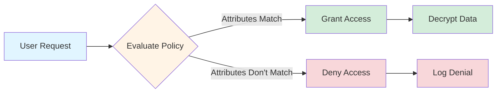

# OpenTDF-RS

A Rust implementation of the OpenTDF (Trusted Data Format) specification, providing data-centric security that travels with the data.

## Overview

OpenTDF-RS enables cryptographic binding of access policies directly to data objects, supporting a Zero Trust security model with continuous verification. This library allows secure data sharing across organizations and industries.

## Features

- TDF Archive Creation and Reading
- Cryptographic Operations (AES-256-GCM encryption)
- Policy Binding through HMAC-SHA256
- Streaming Operations for Efficient Data Handling
- **Attribute-Based Access Control (ABAC)**: Fine-grained access control using attributes
- **Hierarchical Attributes**: Support for attributes with inheritance relationships
- **Time-Based Constraints**: Policies with validity periods
- **Logical Operators**: AND, OR, NOT combinations for complex policies
- **Comprehensive Audit Logging**: Detailed records of access attempts and attribute evaluation
- **KAS (Key Access Service) Integration**: Full rewrap protocol support for production deployments
- **MCP Server with KAS Support**: AI agents can decrypt TDF files using KAS

## Attribute-Based Access Control (ABAC)

OpenTDF-RS implements ABAC to provide fine-grained access control that is cryptographically bound to protected data.



### Core Components

#### AttributeIdentifier

Represents a uniquely identifiable attribute with namespace and name:

```rust
// Create from string in "namespace:name" format
let attr_id = AttributeIdentifier::from_string("gov.example:clearance")?;

// Or create directly
let attr_id = AttributeIdentifier {
    namespace: "gov.example".to_string(),
    name: "clearance".to_string(),
};
```

#### AttributeValue

Supports multiple data types for flexible attribute representation:

```rust
// String value
let value = AttributeValue::String("TOP_SECRET".to_string());

// Numeric value
let value = AttributeValue::Number(42.0);

// Boolean value
let value = AttributeValue::Boolean(true);

// Date/time value
let value = AttributeValue::DateTime(chrono::Utc::now());

// Array values
let value = AttributeValue::StringArray(vec!["ENGINEERING".to_string(), "EXECUTIVE".to_string()]);
let value = AttributeValue::NumberArray(vec![1.0, 2.0, 3.0]);
```

#### Operators

Rich set of comparison operators for attribute evaluation:

| Operator | Description | Example |
|----------|-------------|---------|
| Equals | Exact match | department == "ENGINEERING" |
| NotEquals | Negated match | department != "FINANCE" |
| GreaterThan | Numeric comparison | age > 21 |
| GreaterThanOrEqual | Numeric comparison | priority >= 5 |
| LessThan | Numeric comparison | risk < 3 |
| LessThanOrEqual | Numeric comparison | level <= 4 |
| Contains | String contains | name contains "Admin" |
| In | Value in array | department in ["HR", "LEGAL"] |
| AllOf | All array values present | certifications allof ["ISO", "SOC2"] |
| AnyOf | Any array values present | skills anyof ["Rust", "C++"] |
| NotIn | Value not in array | restricted_country notin ["US", "EU"] |
| MinimumOf | Hierarchical minimum | clearance minimumof "SECRET" |
| MaximumOf | Hierarchical maximum | clearance maximumof "TOP_SECRET" |
| Present | Attribute exists | employee_id present |
| NotPresent | Attribute doesn't exist | terminated notpresent |

#### AttributePolicy

Build complex policy expressions with logical operators:

```rust
// Simple condition
let is_executive = AttributePolicy::condition(
    AttributeIdentifier::from_string("gov.example:role")?,
    Operator::Equals,
    Some("EXECUTIVE".into())
);

// Logical AND
let and_policy = AttributePolicy::and(vec![condition1, condition2, condition3]);

// Logical OR
let or_policy = AttributePolicy::or(vec![condition1, condition2, condition3]);

// Logical NOT (using operator overloading)
let not_policy = !condition1;

// Complex nested policy
let complex_policy = AttributePolicy::or(vec![
    AttributePolicy::and(vec![condition1, condition2]),
    AttributePolicy::and(vec![condition3, !condition4]),
]);
```

#### Policy Structure

Complete policy with time constraints and dissemination:

```rust
// Create policy with attribute conditions and recipients
let policy = Policy {
    uuid: uuid::Uuid::new_v4().to_string(),
    valid_from: Some(chrono::Utc::now()),
    valid_to: Some(chrono::Utc::now() + chrono::Duration::days(30)),
    body: PolicyBody {
        attributes: vec![attribute_policy],
        dissem: vec!["user@example.com".to_string()],
    },
};
```

### ABAC Integration with TDF

The new simplified API makes ABAC policy binding effortless:

```rust
use opentdf::{
    Tdf, Policy, AttributePolicy, AttributeIdentifier,
    AttributeValue, Operator
};
use std::collections::HashMap;

// 1. Create policy with attribute conditions
let clearance = AttributePolicy::condition(
    AttributeIdentifier::from_string("gov.example:clearance")?,
    Operator::MinimumOf,
    Some("SECRET".into())
);

let department = AttributePolicy::condition(
    AttributeIdentifier::from_string("gov.example:department")?,
    Operator::In,
    Some(AttributeValue::StringArray(vec![
        "ENGINEERING".to_string(),
        "EXECUTIVE".to_string()
    ]))
);

// Combine with logical AND
let combined_policy = AttributePolicy::and(vec![clearance, department]);

// Create full policy
let policy = Policy::new(
    uuid::Uuid::new_v4().to_string(),
    vec![combined_policy.clone()],
    vec!["user@example.com".to_string()]
);

// 2. Encrypt with ABAC policy - just 4 lines!
Tdf::encrypt(b"Sensitive information")
    .kas_url("https://kas.example.com")
    .policy(policy)
    .to_file("example.tdf")?;

// 3. Later: Evaluate access based on user attributes
let user_attrs = HashMap::from([
    (
        AttributeIdentifier::from_string("gov.example:clearance")?,
        AttributeValue::String("TOP_SECRET".to_string())
    ),
    (
        AttributeIdentifier::from_string("gov.example:department")?,
        AttributeValue::String("ENGINEERING".to_string())
    ),
]);

let access_granted = combined_policy.evaluate(&user_attrs)?;
assert!(access_granted, "User should have access based on attributes");
```

### Common Policy Patterns

#### Role-Based Restrictions

```rust
// Require specific role
let role_policy = AttributePolicy::condition(
    AttributeIdentifier::from_string("org:role")?,
    Operator::Equals,
    Some("ADMIN".into())
);
```

#### Multi-Department Access

```rust
// Allow access for multiple departments
let dept_policy = AttributePolicy::condition(
    AttributeIdentifier::from_string("org:department")?,
    Operator::In,
    Some(AttributeValue::StringArray(vec![
        "FINANCE".to_string(), 
        "LEGAL".to_string(), 
        "EXECUTIVE".to_string()
    ]))
);
```

#### Clearance Level with Time Restriction

```rust
// Require minimum clearance and time-bound access
let clearance_policy = AttributePolicy::condition(
    AttributeIdentifier::from_string("gov:clearance")?,
    Operator::MinimumOf,
    Some("SECRET".into())
);

let policy = Policy {
    uuid: uuid::Uuid::new_v4().to_string(),
    // Valid for next 24 hours only
    valid_from: Some(chrono::Utc::now()),
    valid_to: Some(chrono::Utc::now() + chrono::Duration::hours(24)),
    body: PolicyBody {
        attributes: vec![clearance_policy],
        dissem: vec!["user@example.com".to_string()],
    },
};
```

#### Location and Network Restrictions

```rust
// Require specific location AND secure network
let location_policy = AttributePolicy::condition(
    AttributeIdentifier::from_string("env:location")?,
    Operator::Equals,
    Some("HEADQUARTERS".into())
);

let network_policy = AttributePolicy::condition(
    AttributeIdentifier::from_string("env:network_type")?,
    Operator::Equals,
    Some("SECURE".into())
);

let security_policy = AttributePolicy::and(vec![location_policy, network_policy]);
```

#### Exclude Temporary Contractors

```rust
// Employees only (NOT contractors)
let contractor_check = AttributePolicy::condition(
    AttributeIdentifier::from_string("org:employment_type")?,
    Operator::Equals,
    Some("CONTRACTOR".into())
);

let employees_only = !contractor_check;
```

## KAS (Key Access Service) Integration

OpenTDF-RS includes full support for the KAS v2 rewrap protocol, enabling production-ready TDF decryption with centralized key management and access control.

### Overview

The KAS protocol allows:
- **Centralized key management**: KAS securely stores and manages encryption keys
- **Access control enforcement**: KAS validates policies and user attributes before releasing keys
- **Audit logging**: All key access attempts are logged for compliance
- **Zero Trust**: Keys are never stored with encrypted data

### Protocol Flow

```
1. Client generates ephemeral EC key pair (P-256)
2. Client builds rewrap request with TDF manifest
3. Client signs request with JWT (ES256)
4. Client POSTs to KAS /v2/rewrap endpoint
5. KAS validates policy and user attributes
6. KAS returns wrapped key + session public key
7. Client unwraps key: ECDH → HKDF → AES-GCM decrypt
8. Client decrypts TDF payload
```

### Basic Usage

The KAS client is enabled by default:

```toml
[dependencies]
opentdf = "0.7"
```

#### Decrypt TDF with KAS

```rust
use opentdf::{TdfArchive, kas::KasClient};

#[tokio::main]
async fn main() -> Result<(), Box<dyn std::error::Error>> {
    // Create KAS client
    let kas_client = KasClient::new(
        "http://kas.example.com/kas",
        "your-oauth-token-here"
    )?;

    // Open and decrypt TDF in one call
    let plaintext = TdfArchive::open_and_decrypt(
        "encrypted-file.tdf",
        &kas_client
    ).await?;

    println!("Decrypted: {}", String::from_utf8_lossy(&plaintext));
    Ok(())
}
```

#### Manual Decryption

For more control over the decryption process:

```rust
use opentdf::{TdfArchive, kas::KasClient};

#[tokio::main]
async fn main() -> Result<(), Box<dyn std::error::Error>> {
    // Create KAS client
    let kas_client = KasClient::new(
        "http://kas.example.com/kas",
        "your-oauth-token-here"
    )?;

    // Open TDF archive
    let mut archive = TdfArchive::open("encrypted-file.tdf")?;
    let entry = archive.by_index()?;

    // Decrypt using KAS
    let plaintext = entry.decrypt_with_kas(&kas_client).await?;

    // Access manifest and policy
    let policy = entry.manifest.get_policy()?;
    println!("Policy: {:?}", policy);

    Ok(())
}
```

### Testing with Real KAS

Integration tests are available that work with a real KAS server:

```bash
# Set environment variables
export KAS_URL="http://10.0.0.138:8080/kas"
export KAS_OAUTH_TOKEN="your-token-here"

# Run KAS integration tests
cargo test --test kas_integration -- --ignored --nocapture
```

### KAS Error Handling

The KAS client provides detailed error information:

```rust
use opentdf::kas::{KasClient, KasError};

match kas_client.rewrap_standard_tdf(&manifest).await {
    Ok(key) => println!("Successfully unwrapped key"),
    Err(KasError::AccessDenied(reason)) => {
        eprintln!("Access denied: {}", reason);
    }
    Err(KasError::AuthenticationFailed) => {
        eprintln!("Invalid OAuth token");
    }
    Err(KasError::HttpError(msg)) => {
        eprintln!("HTTP error: {}", msg);
    }
    Err(e) => {
        eprintln!("KAS error: {}", e);
    }
}
```

### Interoperability

> ⚠️ **Compatibility Note**: opentdf-rs follows the official OpenTDF specification with **camelCase** field names in TDF manifests (`encryptionInformation`, `keyAccess`, etc.). **OpenTDFKit (Swift)** currently uses non-standard **snake_case** field names and is **incompatible**. See [INTEROPERABILITY.md](INTEROPERABILITY.md) for detailed compatibility matrix and workarounds.

The Rust KAS client is fully interoperable with:
- **platform/sdk** (Go): ✅ Fully compatible (spec-compliant)
- **otdfctl** (Go): ✅ Fully compatible (golden implementation)
- **OpenTDF Platform**: ✅ Production KAS deployments
- **OpenTDFKit** (Swift): ❌ Incompatible (uses snake_case - bug in Swift SDK)

TDF files created by spec-compliant SDKs (Go, Rust) can be decrypted across platforms using KAS.

### Security Considerations

#### Cryptographic Algorithms

OpenTDF-RS uses industry-standard cryptographic primitives:

- **Symmetric Encryption**: AES-256-GCM (Authenticated Encryption with Associated Data)
- **Key Wrapping (Standard TDF)**: RSA-2048 with OAEP padding
- **Key Agreement (NanoTDF)**: ECDH with P-256 curve + HKDF-SHA256
- **Policy Binding**: HMAC-SHA256
- **JWT Signing**: ES256 (ECDSA with P-256)

#### ⚠️ SHA-1 Deprecation Notice

**RSA-OAEP Padding**: The current implementation uses **SHA-1** for RSA-OAEP padding to maintain compatibility with the OpenTDF Go SDK (platform). **SHA-1 has known collision vulnerabilities** (see [SHAttered attack](https://shattered.io/)).

- **Why SHA-1?** Required for cross-platform interoperability with existing OpenTDF implementations
- **Risk Level**: Low in this context (used for padding, not primary security)
- **Mitigation**: RSA-2048 key size and OAEP construction provide defense-in-depth
- **Future**: Migration to SHA-256 planned for entire OpenTDF ecosystem

#### Transport Security

When using KAS in production:

- **Always use HTTPS/TLS** for KAS communication (never plain HTTP in production)
- **Validate TLS certificates** - consider certificate pinning for high-security deployments
- **Secure OAuth tokens** - use short-lived tokens, never hardcode credentials
- **Network isolation** - deploy KAS in a protected network segment

#### Key Management Best Practices

- **Ephemeral keys**: Generated fresh for each KAS request, never reused
- **Key rotation**: Support for KAS key rotation through multiple key access objects
- **Audit logging**: All key access attempts should be logged for compliance
- **Access policies**: Enforce attribute-based access control (ABAC) at KAS layer

#### Data-at-Rest Security

- TDF archives use authenticated encryption (AES-256-GCM) preventing tampering
- Policy binding cryptographically ties access policies to encrypted data
- Key wrapping ensures payload keys are never stored in plaintext
- Zero Trust: Encryption keys separated from encrypted data

#### Compliance Considerations

- FIPS 140-2: AES-256-GCM and RSA-2048 are FIPS-approved algorithms
- NIST SP 800-38D: AES-GCM implementation follows NIST guidelines
- **Note**: SHA-1 usage may impact certain compliance requirements - evaluate for your use case

For security vulnerabilities, please see [SECURITY.md](SECURITY.md) (if available) or file an issue.

## MCP Server

OpenTDF-RS includes an implementation of the Model Context Protocol (MCP) server, allowing AI assistants and other tools to interact with TDF capabilities via a standardized API.

### MCP Server Tools

The MCP server provides the following tools:

| Tool Name | Description |
|-----------|-------------|
| `tdf_create` | Creates a new TDF archive with encrypted data |
| `tdf_read` | Reads contents from a TDF archive. Supports optional KAS decryption with `kas_url` and `kas_token` parameters |
| `encrypt` | Encrypts data using TDF encryption methods |
| `decrypt` | Decrypts TDF-encrypted data |
| `policy_create` | Creates a new policy for TDF encryption |
| `policy_validate` | Validates a policy against a TDF archive |
| `attribute_define` | Defines attribute namespaces with optional hierarchies |
| `user_attributes` | Sets user attributes for testing access control |
| `access_evaluate` | Evaluates whether a user with attributes can access protected content with detailed audit records |
| `policy_binding_verify` | Verifies the cryptographic binding of a policy to a TDF |

All access attempts and attribute evaluations are comprehensively logged for compliance and auditing purposes. 
The audit logging system captures detailed information about each operation, including:

- The requesting entity identifiers
- Complete sets of attributes presented
- Attribute sources and verification status
- Detailed evaluation results for each attribute in the policy
- Final access decisions with timestamps
- Policy version information

### Running the MCP Server

To run the MCP server and interact with it via Claude or other MCP-compatible clients:

```bash
cargo run -p opentdf-mcp-server
```

The server listens on stdio for JSON-RPC messages, making it compatible with tools like Claude Code that use the MCP protocol for communication.

### Using with Claude Code

Claude Code can connect to the MCP server to perform TDF operations:

```bash
claude --mcp="cargo run -p opentdf-mcp-server"
```

This starts Claude with the MCP server, allowing you to use TDF capabilities directly within the chat interface.

Example commands:

```
# Create TDF
/mcp opentdf tdf_create {"data": "SGVsbG8gV29ybGQh", "kas_url": "https://kas.example.com", "policy": {"uuid": "sample-uuid", "body": {"attributes": [{"attribute": "gov.example:clearance", "operator": "MinimumOf", "value": "secret"}], "dissem": ["user@example.com"]}}}
```

```
# Read TDF (without decryption)
/mcp opentdf tdf_read {"tdf_data": "<base64-encoded-tdf-data>"}
```

```
# Read and decrypt TDF using KAS
/mcp opentdf tdf_read {"tdf_data": "<base64-encoded-tdf-data>", "kas_url": "http://10.0.0.138:8080/kas", "kas_token": "your-oauth-token"}
```

### ABAC Testing with MCP

The MCP server supports comprehensive ABAC functionality testing:

```bash
# Basic ABAC testing
node tools/test-mcp.js

# Comprehensive attribute access logging test
node tools/audit-logging-test.js
```

These scripts demonstrate:
1. Attribute namespace definition with hierarchies
2. User attribute assignment
3. Policy creation with attribute conditions
4. TDF creation with policy binding
5. Access evaluation based on attributes
6. Policy binding verification
7. Comprehensive audit logging and compliance reporting

The audit logging test generates detailed compliance reports in the `tools/reports` directory. See `tools/audit-guide.md` for more information on the audit logging system.

## Development

### MCP Server Development

The MCP server implements the JSON-RPC 2.0 protocol over stdio to provide TDF capabilities to clients. When developing or extending the MCP server:

1. **Tool Definitions**: Define tools with both `schema` and `inputSchema` fields for compatibility
2. **Protocol Version**: Use the latest MCP protocol version (currently "2024-11-05")
3. **Response Format**: Ensure all responses follow the JSON-RPC 2.0 specification
4. **Error Handling**: Use standard JSON-RPC error codes (-32xxx)
5. **Testing**: Use `tools/test-mcp.js` to verify functionality

If adding new tools, remember to:
- Add the tool to both the initialize response and listTools response
- Implement proper parameter validation
- Follow the JSON-RPC request/response flow
- Document the tool in this README

## Getting Started

### Installation

Add to your Cargo.toml:

```toml
[dependencies]
opentdf = "0.7"
```

### Feature Flags

```text
┌─────────────────────────────────────────────────────────────────────────────┐
│ Feature                    Default   Description                            │
├─────────────────────────────────────────────────────────────────────────────┤
│ kas-client                 ✅        KAS client + aws-lc-rs (FIPS, secure)  │
│ kas-client-rustcrypto      -         KAS client + pure Rust (portable)      │
│ rustls-tls                 ✅        TLS via rustls                         │
│ native-tls                 -         TLS via OpenSSL/SecureTransport        │
└─────────────────────────────────────────────────────────────────────────────┘
```

#### Crypto Providers

| Provider | Timing-Safe | FIPS | Portable | WASM |
|----------|-------------|------|----------|------|
| **aws-lc-rs** (default) | ✅ | ✅ | Needs C compiler | ❌ |
| **rustcrypto** | ❌ [RUSTSEC-2023-0071](https://rustsec.org/advisories/RUSTSEC-2023-0071) | ❌ | ✅ Pure Rust | ❌ |
| **WebCrypto** (WASM only) | ✅ | Browser-dependent | N/A | ✅ |

#### Common Configurations

```toml
# Recommended: Secure defaults (aws-lc-rs + rustls)
opentdf = "0.7"

# Pure Rust: No C compiler needed (accepts timing vulnerability)
opentdf = { version = "0.7", default-features = false, features = ["kas-client-rustcrypto"] }

# Native TLS: Use system TLS (OpenSSL on Linux, SecureTransport on macOS)
opentdf = { version = "0.7", default-features = false, features = ["kas-client", "native-tls"] }

# Minimal: Core TDF operations only (no KAS client, no async)
opentdf = { version = "0.7", default-features = false }
```

#### WASM Note

The `opentdf-wasm` crate uses browser-native **WebCrypto** for RSA operations—no Rust crypto crate needed, no timing vulnerability.

## 🚀 What's New in v0.7.0

Version 0.7.0 brings critical security improvements and better feature organization:

- ✅ **Constant-time RSA**: Default crypto provider changed to aws-lc-rs (FIPS validated)
- ✅ **RUSTSEC-2023-0071 Fixed**: Timing vulnerability eliminated in default builds
- ✅ **cargo-deny Integration**: Automated security advisory and license auditing in CI
- ✅ **Feature Reorganization**: Clearer naming (`kas-client`, `kas-client-rustcrypto`)
- ✅ **WebCrypto for WASM**: Browser builds use native SubtleCrypto API
- ✅ **Pure Rust Option**: `kas-client-rustcrypto` for environments without C compiler

### Migration Guide (v0.6.x → v0.7.0)

**Feature Renaming**:
```toml
# Before (v0.6.x)
opentdf = { version = "0.6", features = ["kas"] }

# After (v0.7.0) - "kas" still works but is deprecated
opentdf = "0.7"  # kas-client is now the default
```

**Pure Rust Builds**:
```toml
# Before (v0.6.x) - not available
# After (v0.7.0) - explicit pure Rust option
opentdf = { version = "0.7", default-features = false, features = ["kas-client-rustcrypto"] }
```

## What's New in v0.5.0

Version 0.5.0 brings significant DX (Developer Experience) improvements:

- ✅ **PolicyBuilder**: Fluent API with auto-defaults
- ✅ **AttributeFqn**: URL-based attribute identifiers
- ✅ **Structured Errors**: Programmatic error handling with suggestions
- ✅ **Prelude Module**: Auto-import extension traits
- ✅ **TdfDecryptBuilder**: Symmetric API for encryption/decryption
- ✅ **40% Fewer Dependencies**: Reduced attack surface
- ✅ **#[must_use]**: Compile-time safety on all builders

### Migration Guide (v0.4.x → v0.5.0)

**Import Changes**:
```rust
// Before (v0.4.x)
use opentdf::{Tdf, Policy, AttributePolicy, ...};

// After (v0.5.0) - Use prelude!
use opentdf::prelude::*;
```

**Policy Creation**:
```rust
// Before (v0.4.x)
let policy = Policy::new(
    uuid::Uuid::new_v4().to_string(),
    vec![attr_policy],
    vec!["user@example.com".to_string()]
);

// After (v0.5.0) - PolicyBuilder!
let policy = PolicyBuilder::new()
    .id_auto()
    .attribute_fqn("https://example.com/attr/clearance/value/secret")?
    .dissemination(["user@example.com"])
    .build()?;
```

**Error Handling**:
```rust
// Before (v0.4.x)
match err {
    TdfError::Structure(msg) => { /* handle String */ }
}

// After (v0.5.0) - Structured errors!
match err {
    TdfError::MissingRequiredField { field } => {
        println!("Missing: {}", field);
        println!("Suggestion: {}", err.suggestion().unwrap());
    }
}
```

**FQN Support** (New in v0.5.0):
```rust
use opentdf::prelude::*;

// Parse URL-based attribute identifiers
let fqn = AttributeFqn::parse("https://example.com/attr/classification/value/secret")?;
assert_eq!(fqn.get_namespace(), "example.com");
assert_eq!(fqn.get_name(), "classification");
assert_eq!(fqn.get_value(), Some("secret"));
```

### Basic Usage

The simplified API makes TDF encryption incredibly easy:

```rust
use opentdf::prelude::*;

// Create a policy with the new builder
let policy = PolicyBuilder::new()
    .id_auto()
    .dissemination(["user@example.com"])
    .build()?;

// Encrypt data - fluent API with #[must_use]
Tdf::encrypt(b"Sensitive data")
    .kas_url("https://kas.example.com")
    .policy(policy)
    .to_file("example.tdf")?;
```

### Encrypt a File

```rust
use opentdf::prelude::*;

let policy = PolicyBuilder::new()
    .id_auto()
    .dissemination(["user@example.com"])
    .build()?;

Tdf::encrypt_file("input.txt", "output.tdf")
    .kas_url("https://kas.example.com")
    .policy(policy)
    .mime_type("text/plain")
    .build()?;
```

### With Attribute-Based Access Control (ABAC)

```rust
use opentdf::prelude::*;

// Create policy with FQN-based attributes
let policy = PolicyBuilder::new()
    .id_auto()
    .attribute_fqn("https://gov.example.com/attr/clearance/value/SECRET")?
    .dissemination(["user@example.com"])
    .build()?;

// Encrypt with ABAC policy
Tdf::encrypt(b"Classified information")
    .kas_url("https://kas.example.com")
    .policy(policy)
    .to_file("classified.tdf")?;
```

## WebAssembly (WASM) Support

OpenTDF-RS can be compiled to WebAssembly and run in both browser and Node.js environments. This enables data-centric security directly in web applications without requiring a server-side component.

### Installation

#### From GitHub Packages

Configure npm to use GitHub Packages for `@arkavo-org` scoped packages:

```bash
# Create/update .npmrc
echo "@arkavo-org:registry=https://npm.pkg.github.com" >> .npmrc

# Install the package
npm install @arkavo-org/opentdf-wasm
```

#### From GitHub Releases

Download pre-built WASM binaries from [GitHub Releases](https://github.com/arkavo-org/opentdf-rs/releases).

### Quick Start

#### Browser

```javascript
import init, { tdf_create, tdf_read, access_evaluate, version } from '@arkavo-org/opentdf-wasm';

// Initialize the WASM module
await init();

console.log('OpenTDF version:', version());

// Create a TDF
const data = btoa('Sensitive information'); // Base64 encode
const policy = {
  uuid: crypto.randomUUID(),
  body: {
    attributes: [],
    dissem: ['user@example.com']
  }
};

const result = tdf_create(
  data,
  'https://kas.example.com',
  JSON.stringify(policy)
);

if (result.success) {
  console.log('TDF created:', result.data);
}
```

#### Node.js

```javascript
const { tdf_create, version } = require('@arkavo-org/opentdf-wasm');

console.log('OpenTDF version:', version());

const data = Buffer.from('Sensitive information').toString('base64');
const policy = {
  uuid: require('crypto').randomUUID(),
  body: {
    attributes: [],
    dissem: ['user@example.com']
  }
};

const result = tdf_create(data, 'https://kas.example.com', JSON.stringify(policy));
console.log('Success:', result.success);
```

### WASM Features

- ✅ TDF archive creation with encryption
- ✅ TDF manifest reading
- ✅ Attribute-Based Access Control (ABAC) policy evaluation
- ✅ Policy creation and validation
- ✅ Works in browser and Node.js environments
- ✅ Optimized for size (~200KB gzipped for web)

### Building from Source

```bash
# Install wasm-pack
cargo install wasm-pack

# Build for web
cd crates/wasm
wasm-pack build --target web --out-dir pkg-web

# Build for Node.js
wasm-pack build --target nodejs --out-dir pkg-node
```

### GitHub Releases

WASM artifacts are automatically built and published for:
- **Feature branches**: Built on every push for testing (artifacts retained 7 days)
- **Main branch**: Built and retained as latest artifacts (90 days)
- **Tagged releases**: Full releases with downloadable archives and checksums

Download options:
- `opentdf-wasm-web.tar.gz` - Web browser target
- `opentdf-wasm-node.tar.gz` - Node.js target
- `opentdf-wasm-combined.tar.gz` - Both targets in one archive

All releases include SHA256 checksums for verification.

For complete WASM documentation, see [crates/wasm/README.md](crates/wasm/README.md).

## Performance Benchmarks

OpenTDF-RS includes comprehensive performance benchmarks for in-memory TDF operations, demonstrating production-ready performance across various file sizes.

### Quick Summary

| Operation | 1 KB | 100 KB | 1 MB |
|-----------|------|--------|------|
| TDF Creation | 38.9 µs | 838 µs | 10.5 ms |
| TDF Reading | 7.8 µs | 60.6 µs | 580 µs |
| Encryption | 26.7 µs | 625 µs | 5.78 ms |
| Archive Building | 5.5 µs | 53.1 µs | 514 µs |

**Throughput**: ~100 MiB/s sustained for complete TDF creation operations

### Running Benchmarks

```bash
# Run all benchmarks
cargo bench --bench memory_builder

# View HTML reports
open target/criterion/report/index.html
```

### Key Results

- **Fast Small File Operations**: <40µs overhead for 1KB files
- **Scalable Performance**: Consistent throughput from 1KB to 1MB+
- **In-Memory Operations**: 1.86 GiB/s archive building (no filesystem bottleneck)
- **WASM Compatible**: Zero filesystem dependencies, ideal for browser/WASI

For detailed benchmark results and analysis, see [BENCHMARKS.md](BENCHMARKS.md).

## WASI (WebAssembly System Interface) Support

OpenTDF-RS works seamlessly in WASI environments, enabling secure TDF operations in sandboxed WebAssembly runtimes like Wasmtime.

### What is WASI?

WASI provides a standardized system interface for WebAssembly, offering:
- Sandboxed execution with capability-based security
- Cross-platform portability
- Native-like performance
- No filesystem dependencies required

### Quick Start

```bash
# Install WASI target
rustup target add wasm32-wasip1

# Install Wasmtime
curl https://wasmtime.dev/install.sh -sSf | bash

# Build and run the test
cd tests/wasi
cargo build --target wasm32-wasip1 --release
wasmtime target/wasm32-wasip1/release/opentdf-wasi-test.wasm
```

### Example Output

```
=== OpenTDF WASI Example ===

Original data: Hello from WASI! This is confidential data.
Data size: 43 bytes

Creating policy...
Policy created with UUID: c27f405b-d208-4610-ae24-f58c464714c1

Encrypting data...
Encryption successful!

Building TDF archive in memory...
TDF archive created!
  Archive size: 1544 bytes

Reading TDF archive from memory...
Archive opened successfully

=== WASI Test Complete ===
✓ TDF creation (in-memory) - SUCCESS
✓ TDF reading (in-memory) - SUCCESS
✓ No filesystem operations required!
```

### What This Demonstrates

- ✅ **Complete TDF Lifecycle**: Creation, encryption, and reading entirely in memory
- ✅ **Zero Filesystem Access**: All operations use `io::Cursor<Vec<u8>>`
- ✅ **WASI Sandbox**: Secure cryptographic operations in capability-based environment
- ✅ **Cross-Platform**: Same binary runs on Linux, macOS, Windows with Wasmtime

### Performance

- **Binary Size**: ~2.1 MB (optimized WASM)
- **Execution Time**: <50ms total
- **Memory Usage**: ~5MB peak
- **Startup Time**: <10ms

For complete WASI documentation and advanced usage, see [tests/wasi/README.md](tests/wasi/README.md).

## License

This project is licensed under [LICENSE].